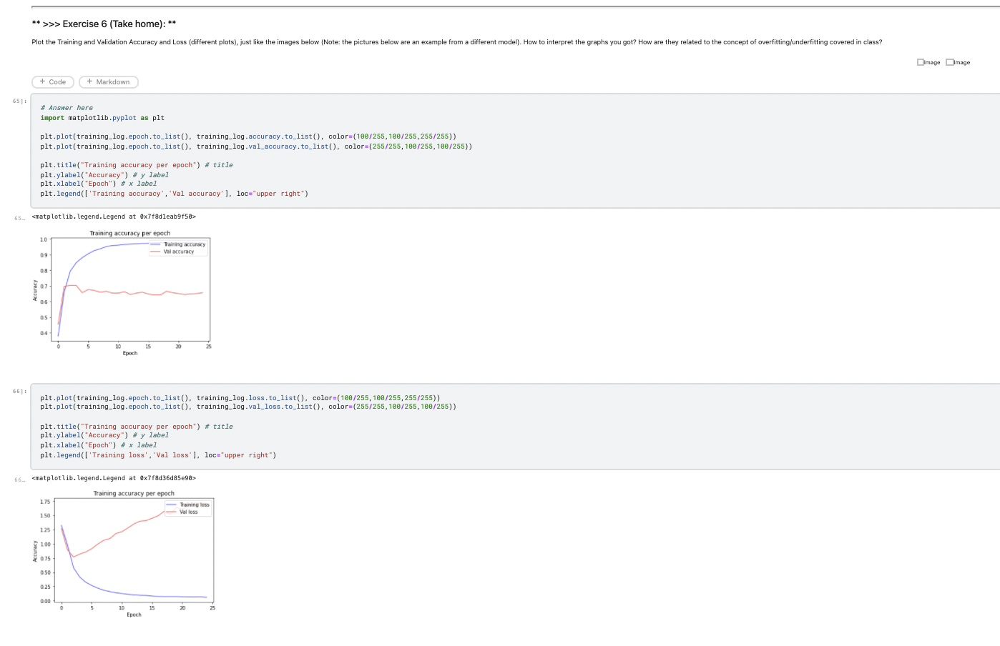

# datamining-lab2

Due to the problems of kernel and file size, codes can’t run at the same environment.  
Therefore, considering TA’s hardworking for the class, I have captured the results and show it in the READMD.md!
 

- Exercise6
  
